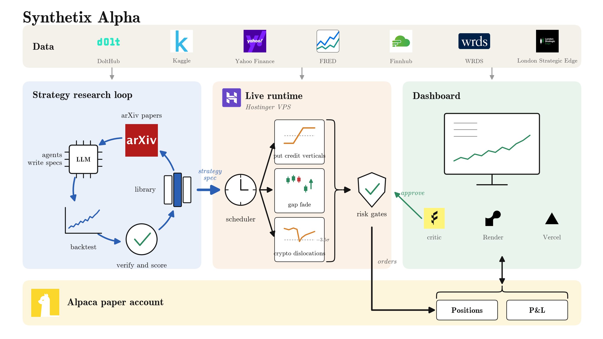

# Synthetix Alpha

An autonomous, risk-gated trading agent on Alpaca: LLM agents research strategies from arXiv and verify them out of
sample; a deterministic runtime trades options, equities and crypto on Alpaca paper through the Alpaca CLI.

> **Write-up:** [docs/writeup.pdf](docs/writeup.pdf) — one page on the AI logic, the risk gates and the Alpaca
> infrastructure. **Slides:** [docs/slides/synthetix_alpha_slides.pdf](docs/slides/synthetix_alpha_slides.pdf).
> **Architecture:** [docs/img/architecture.pdf](docs/img/architecture.pdf). **Research log:**
> [docs/research.md](docs/research.md).



One rule runs through the whole system: LLM agents research, a deterministic runtime trades. The model reads papers,
writes strategy specs and reviews candidates in the dashboard; it never sees a broker key and is never in the order
path.

## Setup

```sh
git submodule update --init
py -3.13 -m venv .venv && .venv/Scripts/activate
pip install -e external/gs-quant -e .[dev]
cp .env.example .env   # ALPACA_API_KEY / ALPACA_API_SECRET at minimum; see the table below
pytest
```

| key | needed for |
|---|---|
| `ALPACA_API_KEY`, `ALPACA_API_SECRET` | the paper account: market data and orders |
| `FRED_API_KEY`, `FINNHUB_API_KEY` | macro and news context for the dashboard critic |
| `FEATHERLESS_API_KEY` (or `OPENAI_API_KEY`) | the critic; without a key it runs in mock mode and says so |
| `WRDS`, `LSE_API_KEY` | research validation only, nothing live reads them |

## Strategy research

`synthetix_alpha/strategy`: a declarative `Spec` (legs by delta, moneyness or width; DTE window; signal gates over 22
trailing-only features; exits; sizing; costs) interpreted by a deterministic daily backtester over real end-of-day
chains. Fills at mid plus half the spread, $0.65 per contract and leg, a same-day volume floor, OCC split adjustment,
settlement at intrinsic. Research agents mutate specs, never code.

```sh
python -m synthetix_alpha.strategy.run spec.json --out results.json               # Kaggle chains, 2016-2023
python -m synthetix_alpha.strategy.run spec.json --source dolt --start 2023-01-01  # DoltHub surfaces + Alpaca spot, out of sample
python -m synthetix_alpha.strategy.verify spec.json --oos AAPL --dolt SPY         # unseen underlying, unseen vendor, fragility sweep
python -m synthetix_alpha.strategy.plots spec.json                                # docs/img/<spec>_performance.png
python -m synthetix_alpha.strategy.progress spec.json --gen N                     # append to docs/progress.md
```

Candidates are scored on `0.5*mean_sharpe + 0.5*min_sharpe + 2*worst_year + 3*max(maxDD, -1) + (positive_years - 1)`,
with fewer than 40 trades scoring -9. The progress log ([docs/progress.md](docs/progress.md)) is append-only and keeps
corrections even when the score falls.

## Agentic research loop

New arXiv papers feed the strategy search. The deterministic half (search, relevance filter, PDF download, the library
of papers already seen, backtesting what comes back) lives in `synthetix_alpha/research/`; the reading and spec-writing
is done by agents via [workflows/paper_research.js](workflows/paper_research.js).

```sh
python -m synthetix_alpha.research.loop find --limit 5     # queue papers, print the agent brief
# hand the brief to the workflow, which writes Spec JSON files
python -m synthetix_alpha.research.loop evaluate           # backtest them against the incumbent
```

Papers already seen are in [docs/papers.jsonl](docs/papers.jsonl). The brief tells the agent that a mean-Sharpe gain
under 0.54 is inside this sample's noise, the floor measured in the research log. `synthetix_alpha/pipeline/` holds the
LLM client and a benchmark harness that scores open models on spec generation and critic consistency.

## Live runtime

`synthetix_alpha/live/` is the part that trades. A scheduler fires the runner at 09:31 (enter), 09:45 (top-up), 15:50
and 15:56 (flatten) ET, each in a clean subprocess, marking state before each fire so a crash never retries. Three
sleeves ride along with every entry run:

- **Options**: put credit verticals from the screen, `strategies/put_vertical_ivrv.json` and its single-name variant.
- **Gap fade**: 198 large caps, the ten most negative volatility-scaled overnight gaps bought at the open, flat by the close.
- **Crypto dislocations**: 18 pairs, a 24-hour move below -3.5 sigma of hourly volatility, held 48 hours, at most three open.

```sh
python -m synthetix_alpha.live.run --intraday-top 10 --intraday-budget 1.5   # dry run of one entry
python -m synthetix_alpha.live.run --flatten                                 # dry run of the close
python -m synthetix_alpha.live.schedule --execute                            # the loop, live on paper
```

Everything is a dry run unless `--execute` is passed. Entries are refused outside 09:31-10:30 ET, flattening outside
15:30-15:58, and weekends always. In production the scheduler runs in a tmux session on a Hostinger VPS with a cron
watchdog that restarts it within five minutes.

## Risk gates

Every order, from the scheduler or the dashboard, passes the same code before it reaches the broker. Limits live in
[config/governance.yaml](config/governance.yaml) and [config/universe.yaml](config/universe.yaml), so they are
auditable without touching code.

- **Account**: positive NAV; halt at 20% total or 5% daily drawdown; leverage 1x; 10% of NAV per name; 12 open
  positions; defined-risk structures only; 3% of equity at risk per position on the payoff grid.
- **Screen** (`live/screen.py`, over the ~1,500-name DoltHub vol history): IV/RV between 1.25 and 2, price above $5,
  $20M average daily volume, chain spread under 10% of mid measured from OptionMetrics, no earnings within 30 days.
- **Order**: credit at least 5% of max loss; the credit re-priced at bid and ask must clear 60% of the mid credit; 25
  contracts of same-day volume; whole contracts only.
- **Intraday**: a corporate-action guard on gaps beyond 25%; the ranking refuses a stale session; exits are sized to
  the actual fill; flattening covers only what is held, in two passes.
- **Idempotency**: the client order id is a hash of the legs and the date, checked in a local ledger and against the
  broker; status is never reported as filled unless Alpaca said so.
- **Paper only**: the runner asserts paper mode and strips the live-trading switch from every child environment.

```python
from synthetix_alpha.live import Rules, apply, submit
decision = apply(orders, positions, nav, Rules.load())   # defined-risk only, per-position and NAV caps, drawdown halts
submit(legs, contracts, limit_price)                      # dry-run by default; deterministic client_order_id
```

## Alpaca: the CLI for trading, the SDK for data

Every account read and every order goes through Alpaca's CLI (`alpacahq/cli`); `synthetix_alpha/live/cli.py` is the
transport. Spreads are multi-leg limit orders (`--order-class mleg`, up to four legs, day time in force); the equity
basket and crypto use market orders. The dashboard's Docker image builds the CLI from source so Render runs the same
transport as the VPS.

```bash
go install github.com/alpacahq/cli/cmd/alpaca@latest   # or: brew install alpacahq/tap/cli
# or drop the release binary at tools/alpaca.exe; override with ALPACA_BIN
alpaca account get                                     # ALPACA_API_KEY / ALPACA_SECRET_KEY from .env
```

Market data goes through the alpaca-py SDK (`synthetix_alpha/data/alpaca.py`): option-chain snapshots with implied
vol and greeks, split-adjusted stock bars down to one minute, crypto hourly bars. Backtests, the intraday ranking and
the screen are bulk data jobs that the SDK's historical clients batch and page; the CLI is a per-call tool and is not
the right instrument for them. The SDK's trading client is used only to read option-contract metadata.

```python
import datetime as dt
from synthetix_alpha.data import AlpacaClient, BarStore, OptionBarsDataSource, chain_bars, register
from synthetix_alpha.data import dolt, kaggle
from gs_quant.backtests.data_sources import DataManager

c = AlpacaClient()
chain = c.option_chain("SPY", expiration_date="2026-09-02")      # bid/ask/IV/greeks per contract
bars = c.option_bars(chain.index[:5], "15Min", start="2026-08-20")  # OHLCV history (Feb 2024+)

store = BarStore(c)
store.ensure("option", "1Day", chain.index, dt.date(2026, 8, 1), dt.date.today())  # one batched fetch for the whole chain
dm = DataManager()
option = register(dm, OptionBarsDataSource(symbol=chain.index[0], store=store))  # use `option` in gs-quant triggers/actions

chains = kaggle.load_chains("QQQ")                 # EOD chains 2016-2023: AAPL, NVDA, QQQ, SPY, TSLA; (date, symbol) x CHAIN_COLUMNS
surface = dolt.load_chains(["SPY", "QQQ"], dt.date(2023, 1, 1), dt.date(2024, 12, 31))   # DoltHub post-no-preference/options
vol = dolt.load_volatility(["SPY"], dt.date(2023, 1, 1), dt.date(2024, 12, 31))
```

Other sources: Yahoo Finance (earnings dates, splits), FRED (VIX, VXN, VXV, NFCI, macro), Finnhub (news, sentiment),
FOMC dates, and for validation only WRDS (OptionMetrics, CRSP) and London Strategic Edge.

## Dashboard and the Featherless critic

`synthetix_alpha/api/` is a FastAPI adapter over the live modules; `frontend/` is a Next.js command centre (pipeline
trace, opportunities, positions, execution ledger, research view from the progress log). The pipeline is
screen → gather (Finnhub, FRED) → critique → form → risk → operator approval → paper execution. The critic is a
Featherless-hosted model prompted as a risk officer; it is advisory, every approval re-runs the deterministic risk
gate, and the operator confirms in two steps.

```sh
python -m synthetix_alpha.api                              # http://127.0.0.1:8000, GET /v1/overview
cd frontend && npm install && npm run dev                  # NEXT_PUBLIC_DASHBOARD_API_URL=http://127.0.0.1:8000
python -m synthetix_alpha.pipeline.orchestrator --dry-run  # the pipeline end to end, no orders
docker build -t synthetix-alpha . && docker run -p 8000:8000 --env-file .env synthetix-alpha
```

Production runs the API on Render from the Dockerfile and the frontend on Vercel.

## Deployed strategy

`strategies/put_vertical_ivrv.json`: put credit vertical on SPY and QQQ (sell the 20-delta put, buy the 10-delta,
about 65 DTE), entered only when both the option chain and the matching CBOE index (VIX or VXN) say implied vol is
rich versus realised; exit at 65% of the credit, a 2x stop or 21 DTE; 3% of equity at risk, 12 slots, daily entry. In
sample 2020-2022: Sharpe 0.92, max drawdown 2.0%, 102 trades. Out of sample: Sharpe 0.65 on independent 2019-2026
vendor data, 0.49 on AAPL, which was never used to fit it. The number to plan around is the out-of-sample one.

`strategies/put_vertical_singlename.json` applies the same rule to single names with a yfinance earnings blackout
(AAPL: Sharpe 0.46 -> 0.90, max drawdown -7.7% -> -2.1%). `strategies/portfolio.json` runs three sleeves at equal
weight; every optimised weighting beat equal weight in sample and lost to it out of sample.

Three findings from the research log worth knowing before reading any number above: a same-day volume floor cut the
in-sample Sharpe from 1.15 to 0.92 and closed the gap to out-of-sample, so the earlier figure was partly quotes that
never traded; on OptionMetrics with overlap-corrected errors the IV/RV gate's premium advantage sits inside the noise;
and the gap fade's backtested edge, re-measured on minute bars from the price a market order actually gets, was an
artefact of the opening print.


