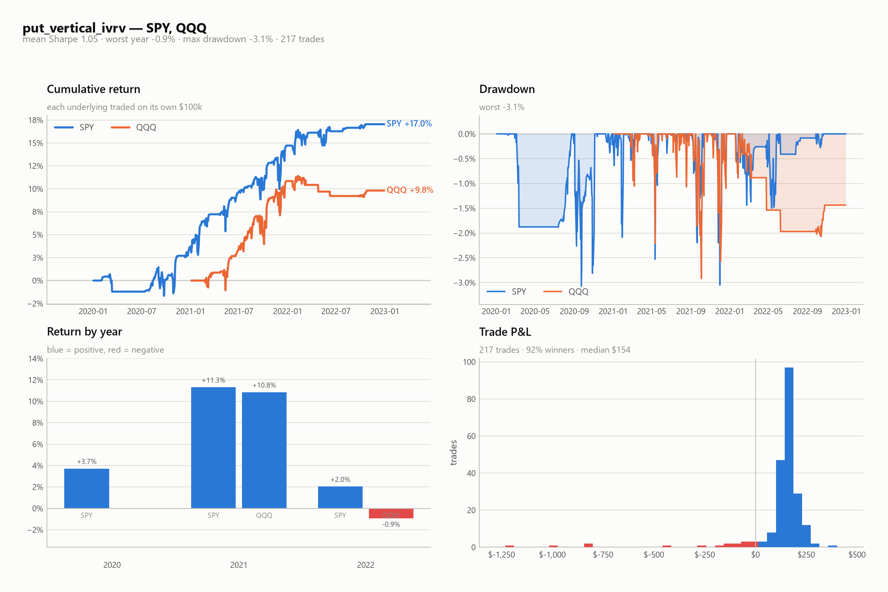
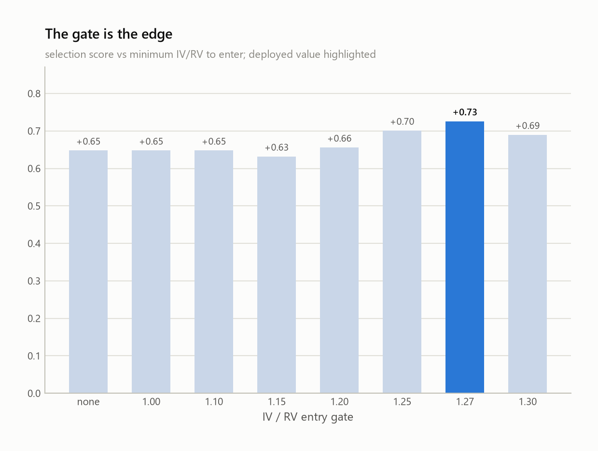

# Strategy research: how the deployed rule was found

Agent-designed, deterministically executed. LLM agents generate and mutate **strategy specs** (declarative JSON);
a frozen deterministic backtester scores them. No model sits in the live order path.

## Method

1. **Spec DSL** (`synthetix_alpha/strategy/spec.py`) — legs by delta/moneyness/width (+`dte_offset` for
   diagonals/calendars), DTE window, entry cadence, signal gates over nine trailing features, exits, sizing, costs.
2. **Engine** (`engine.py`) — daily loop over real EOD chains: fills at mid ± half-spread × slippage, $0.65/contract/leg
   each way, marks at mid, settles at intrinsic, positions sized by payoff-grid max loss. Costs are fixed across all
   candidates so results are comparable.
3. **Fitness** — `0.5·mean_sharpe + 0.5·min_sharpe + 2·worst_year + 3·max(maxDD,−1) + (positive_years−1)`,
   scored across underlyings; fewer than 40 trades scores −9. Robustness beats peak return by construction.
4. **Search** — 8 strategy angles × 2 candidates seeded generation 0; 3 generations of parameter/structural mutation
   and crossover on the top 5, agents run concurrently. 7 research papers were mined in parallel for seed ideas.
5. **Verification** (`verify.py`) — parameter fragility sweep, out-of-sample regimes, P&L concentration.

**140+ candidates** evaluated. Data: Kaggle EOD chains (SPY 2020–22, QQQ 2021–22, AAPL 2016–23, NVDA, TSLA) with real
bid/ask/IV/greeks, plus an independent vendor (DoltHub `post-no-preference/options`, 1,522 names, 2019–2026) used
strictly as out-of-sample.

## The central finding: the gate is the edge

Holding the structure fixed and sweeping only the entry gate (implied vol vs 20-day realised vol):

| IV/RV gate | score | mean Sharpe | min Sharpe | max DD | trades | fires (last 60d) |
|---|---|---|---|---|---|---|
| none | **−0.78** | −0.01 | −0.31 | −4.9% | 214 | 100% |
| ≥ 1.00 | −0.57 | 0.06 | −0.19 | −2.4% | 134 | 40% |
| ≥ 1.10 | 0.20 | 0.37 | 0.14 | −2.0% | 96 | 32% |
| ≥ 1.15 | 0.14 | 0.65 | 0.15 | −2.0% | 86 | 25% |
| ≥ 1.20 | 0.77 | 0.89 | 0.70 | −1.2% | 76 | 20% |
| ≥ 1.25 | **0.96** | 1.04 | 0.94 | −1.1% | 63 | 18% |

Selling put spreads **unconditionally loses money** (Sharpe ≈ 0 before costs bite). Selling them only when implied
volatility is rich relative to realised earns Sharpe ≈ 1.0. The monotonicity across seven thresholds is the evidence
this is the variance risk premium being harvested conditionally, not a fitted artifact — an independent review of seven
options papers ranked the same conditional-VRP family first.

## Generation 4: an independent check on the vol gate

Adding CBOE's own indices (VIX from 1990, VXN from 2001, FRED daily closes) served two purposes.

First, **validation**: the chain-derived ATM IV correlates **0.984** with VIX on SPY and **0.985** with VXN on QQQ over
the backtest window. It sits about 4 vol points lower, exactly as expected — VIX prices the whole strip including the
OTM put skew, while the chain measure is the at-the-money point. The surface construction is sound.

Second, **an independent replication of the central finding**. Sweeping a VIX-based gate reproduces the same monotonic
curve on its own scale — score −0.59 at `VIX/RV ≥ 1.0` rising to +1.08 at 1.6 — using a public, market-standard measure
that never touches the chain code. Two different instruments, same conclusion.

Requiring *both* gates to agree then improved the deployed rule: score 1.089 → **1.112**, fragility median 0.94 → 0.97,
and out-of-sample on the independent Dolt data 0.177 → **0.202** (Sharpe 0.65 → 0.67). One result cut the other way and
is worth recording: filtering out high-VIX percentiles ("skip the crisis") *hurt* badly, 1.089 → 0.757. Panic is when
the premium is richest, and the strategy wants those days.

## Generation 3: robustness became the objective

Verification of the generation-2 leader exposed a knife-edge: shifting its DTE window ±10 days collapsed the score
from 0.98 to 0.28 / 0.07. Generation 3 therefore optimised a **robust score** = `0.6·base + 0.4·fragility_median`,
with each agent running the verification harness on its own candidate and reporting its own gate firing rate.

**The key insight — DTE fragility was a *location* problem, not a *width* problem.** Sweeping `dte_target` from 30 to
70 reveals a hole at 35–45 (scores −1.7 to 0.4) and a broad plateau at 55–70. The old champion sat at 45, on the edge
of the hole, so widening its window did not help. Re-centring at **65 DTE** puts the entire ±10 neighbourhood on the
plateau. That single change, not parameter tuning, is what fixed the fragility.

A second reusable finding, from the condor line: capping the holding period with `max_hold_days` decouples P&L from
the DTE window, turning its DTE−10 score from unscoreable to +0.86.

| candidate | robust | base | fragility median | DTE −10 / +10 | trades | fires |
|---|---|---|---|---|---|---|
| **`put_vertical_ivrv`** | **1.03** | 1.09 | 0.94 | 0.85 / 1.01 | 104 | 25% |
| `put_diagonal_ivrv_robust` | 0.93 | 1.01 | 0.81 | 0.41 / 0.40 | 189 | 25% |
| `index_condor_trend` | 0.87 | 0.97 | 0.72 | 0.86 / 0.68 | 140 | 26% |
| gen-2 champion (diagonal) | 0.88 | 0.98 | 0.75 | 0.07 / 0.28 | 59 | 18% |

## Deployed rule — `strategies/put_vertical_ivrv.json`

Put credit **vertical** on SPY and QQQ — single expiry, so one standard 2-leg `mleg` order:

- **Entry** every 3 days, max 5 concurrent, only when **both** vol measures agree the premium is rich: the chain's own
  `IV/RV ≥ 1.27` *and* the market's index (VIX for SPY, VXN for QQQ) `VIX/RV ≥ 1.4`.
- **Structure** — sell the 20-delta put, buy the 10-delta put, same expiry, ~65 DTE (40–90 window).
- **Exits** — take profit at 65% of the credit, stop at 2× credit, close at 21 DTE.
- **Sizing** — 3% of equity at risk per position against payoff-grid max loss; skip entries whose credit is under
  5% of max loss, or whose contracts traded fewer than 25 times that day.

In-sample: mean Sharpe **0.92**, max drawdown 2.0%, 102 trades, after the same-day liquidity floor described below.
(Without that floor it reads 1.15, which the liquidity evidence says is not achievable.)

**The double gate is index-only.** `vix_rv_ratio` compares an index's implied vol to that same index's realised vol, so
it exists for SPY and QQQ and nothing else — dividing VIX by a single stock's realised vol is not a meaningful ratio,
and the loader deliberately refuses to compute it. For single names use `strategies/put_vertical_ivrv_chainonly.json`,
the same rule with the chain gate alone.

Alternates kept for regime coverage: `put_diagonal_ivrv_robust.json` (189 trades, adds NVDA) and
`index_condor_trend.json` (two-sided, index-only — it fails on single names).




## What verification found




**Survives** (numbers are for the deployed `put_vertical_ivrv`):
- **Independent vendor, unseen years** — Dolt SPY 2019–2026 (the fitting data ends in 2022): Sharpe **0.65** over
  148 trades, positive in 5 of 8 years.
- **Unseen underlying** — AAPL 2016–2023, never used to fit it: Sharpe **0.49**, 184 trades, positive in 6 of 8 years.
- **Fragility** — median perturbed score **0.94** against a base of 1.09; 82% of perturbations stay above half the base.
  The ±10-day DTE shift, which broke the previous champion, now scores 0.85 / 1.01.
- **Costs** — doubling slippage to the full half-spread leaves the score above 0.9.
- **P&L is not concentrated** — the top 5 of 65 SPY trades are 15% of profit (20% on QQQ); median trade positive.

**Weaknesses — stated plainly:**
- **The gate cannot be loosened.** Dropping it 10% (to ~1.14) turns the score negative (−0.08). The edge lives at
  IV/RV ≥ ~1.2; below that the variance risk premium does not cover costs.
- **Long-leg delta is a cliff.** Moving the long leg from 10-delta to 5-delta drops entries below the 40-trade floor —
  those strikes have no reliable bid.
- **Out-of-sample is materially weaker than in-sample** (Sharpe 0.49–0.65 vs 1.13). Expect the lower number live.
- **Single names are the least validated part.** The condor line fails outright on AAPL (score −2.05) and the robust
  diagonal scores −0.75 there; only the vertical holds up out-of-sample on a single name.

## Earnings: the filter that unblocks single names

yfinance supplies announcement dates (AAPL back to 2002) and split history for free, so `days_to_earnings` is now a
feature. On AAPL — a single name the index rule was never fitted on — it is decisive:

| variant | score | Sharpe | max DD | worst year | trades |
|---|---|---|---|---|---|
| no earnings filter | −0.151 | 0.46 | −7.7% | −6.4% | 185 |
| **no announcement within 30 days** | **+0.838** | **0.90** | **−2.1%** | +0.1% | 78 |
| only when earnings ≤ 20 days away | −0.597 | 0.11 | −9.1% | −8.9% | 96 |

Two things make this credible where the earlier feature tests were not. The swing is +0.99, roughly twice the 0.54
Sharpe difference this sample can actually resolve. And the inverse test confirms the mechanism rather than just the
correlation: deliberately selling premium *into* announcements produces the losses, which is what the earnings-jump
story predicts.

This is what `strategies/put_vertical_singlename.json` uses, and it removes the blocker on the breadth plan — the
screener could previously only surface single names it was unsafe to trade.

yfinance also confirms the split problem documented under engine limitations: `spans_split("AAPL", 2016, 2023)`
returns 2020-08-31, the unadjusted 4:1. Positions held across that date are still mismarked; the accessor exists now,
the adjustment does not.

## The liquidity check that changed the headline number

Kaggle's chains carry per-contract volume, which the engine originally discarded. Joining it back to the trade log
asked a question no feature test can: **were the contracts this strategy picked actually tradable?**

| contracts on the day they were traded | share of legs |
|---|---|
| volume = 0 | **9.8%** |
| volume < 10 | 34.3% |
| volume < 100 | 67.6% |

Median volume was 31 contracts, and the median quoted spread 0.9% of mid. A mid-price fill in a contract that did not
trade at all that day is not a fill; it is a quote. So `min_volume` was added to the spec and the deployed rule now
requires 25 contracts of same-day volume — at 2–3 contracts per position that keeps the order near a tenth of the day's
flow.

| `min_volume` | score | mean Sharpe | min Sharpe | trades |
|---|---|---|---|---|
| 0 (original) | +1.112 | 1.15 | 1.14 | 102 |
| 10 | +0.653 | 0.99 | 0.85 | 102 |
| **25 (deployed)** | **+0.520** | **0.92** | **0.70** | 102 |
| 100 | −0.265 | 0.53 | −0.22 | 99 |

The trade *count* barely moves, so this is not a sample-size effect — the filter changes **which strike** is selected,
and the liquid strikes perform worse. Part of the original headline came from contracts whose mid price was a
quote-derived fiction.

The strongest evidence that this correction is right: **the in-sample/out-of-sample gap closed.** Before the filter,
in-sample Sharpe 1.15 against 0.67 out-of-sample. After it, 0.92 against the same 0.67. Filtering removed illusion
rather than edge, and the honest expectation for live trading is now roughly what the out-of-sample data always said.

## Do technical indicators help? Tested, and mostly no

RSI, Bollinger position, MACD (all from `gs_quant.timeseries.technicals`), momentum, trend ratios, relative volume and
VWAP deviation are all available as features. Adding each as an extra entry gate on the deployed rule:

| added gate | score change |
|---|---|
| `rsi <= 70` / `rsi 30-70` | −0.001 / −0.014 |
| `bollinger_pos <= 0.8` / `>= 0.2` | −0.097 / −0.271 |
| `macd >= 0` (uptrend) | −0.240 |
| `mom20 >= 0` | −0.296 |
| `sma50_ratio >= 0` | −0.523 |
| `sma200_ratio >= 0` (bull market only) | **−1.020** |
| `macd <= 0` (downtrend) | −10.1 (falls below the trade floor) |

**Not one directional filter helps.** The reason is structural: the edge is a variance risk premium, which is a
volatility phenomenon, so filtering by price direction removes trades at random with respect to the actual edge and
just shrinks the sample. `sma200_ratio >= 0` is the sharpest illustration — restricting a put spread to bull markets
costs a full point of score, because the premium is richest precisely when the tape is not calm. The same logic showed
up in the VIX work: excluding high-VIX percentiles also hurt.

Two microstructure filters did look different, because they condition on *disturbance* rather than *direction*:
`rvol <= 1.5` (+0.067, monotone across thresholds) and `|vwap_dev| <= 0.005` (+0.121) — both saying "trade on calm,
orderly sessions". Combined they gave +1.120 in sample against the deployed +1.112.

**They did not survive out-of-sample and were rejected.** On the independent Dolt data the calm-filtered variant scores
0.017 with Sharpe 0.48, against the deployed rule's 0.202 and Sharpe 0.67. Around 28 variants were tried against the
same in-sample window, so the best few were always likely to be noise; this is what that looks like when you check.
The features stay in the codebase for future generations to use, but the deployed spec does not use them.

One caveat in the other direction: on the much shorter-horizon `index_condor_trend` (11-33 DTE, held at most 10 days),
`mom20 >= 0` was worth +0.174 and `macd >= 0` +0.079. Horizon plausibly matters, and a directional filter may earn its
place on a short-dated structure. That result is unverified out-of-sample and the condor already fails on single names,
so it is a lead rather than a finding.

## Deployment risk the search did not optimise for

The fitness function rewarded risk-adjusted return over three years. It never asked **"will this trade this week?"**

The gate fires on ~25% of days. SPY's IV/RV is currently ~1.15 by the engine's definition — **below the threshold**.
Deployed on SPY alone over a handful of trading days, the most likely outcome is **zero trades and zero P&L**.

The fix is **breadth, not a weaker gate** — loosening the gate is exactly where the edge disappears. A cross-sectional
scan of the 1,522-name Dolt universe found **222 names (15%) above IV/RV ≥ 1.25** on the same date SPY was below it.

**The edge does generalise across names.** Running the same rule over ten large caps on the independent Dolt data
(2019–2026) gives a median Sharpe of **0.61 with 8 of 10 positive**:

| | COST | AMZN | JPM | META | MSFT | AAPL | GOOGL | UNH | WMT | XOM |
|---|---|---|---|---|---|---|---|---|---|---|
| Sharpe | 1.12 | 0.85 | 0.69 | 0.63 | 0.62 | 0.60 | 0.59 | 0.33 | −0.17 | −0.31 |

So the conditional variance risk premium is not an SPY artifact, and a breadth basket is a legitimate way to keep the
gate strict while still trading. `synthetix_alpha/live/screen.py` implements the daily scan against the liquidity
floors in `config/universe.yaml`.

**But the screener is not yet safe to trade unattended.** Running it today returns NTAP, ADSK, ASO, PVH, CASY and AEO
— every one of them reporting earnings within days. That is exactly the trap: high IV/RV usually prices a scheduled
event, and the premium is compensation for real jump risk. The `iv_rv_max` cap (default 2.0) removes only the most
extreme cases. **An earnings-calendar filter is a required prerequisite before any single-name deployment**, and it
does not exist yet. Until it does, the index pair (SPY/QQQ) is the only validated way to run this.

## Recommended live risk gates

- Defined-risk structures only (every position has a bought wing); no naked short options.
- 3% of equity at risk per position, max 5 concurrent → ≤15% of the account at risk.
- Skip any underlying with a scheduled earnings date inside the position's life (**not yet implemented** — this is
  why single-name trading is gated off; see the screener caveat above).
- Require the quoted credit to be ≥5% of max loss, and both legs to have a real bid (≥ $0.05).
- Halt new entries after a 5% account drawdown.

## Evolutionary path

- **Helped:** adding the IV/RV gate (the whole edge); re-centring the DTE window onto the 55–70 plateau
  (0.98 → 1.09 with far better stability); wider 20/10-delta wings over 30/15; a 65% profit target; capping the
  holding period with `max_hold_days` to decouple P&L from DTE.
- **Helped, then superseded:** the `dte_offset` long leg (the diagonal beat the vertical at 45 DTE, 0.73 → 0.96) —
  but once the vertical was moved to 65 DTE it overtook the diagonal on every axis, and it is simpler to execute.
- **Hurt / discarded:** unconditional premium selling (loses to costs); long-vol structures (straddles, strangles,
  calendars — negative carry); 60-day condors; 4-DTE technical-signal spreads from the Carlier paper
  (best variant: AAPL Sharpe 0.80, but QQQ −0.14 and the unconditional control lost 49% on QQQ).
- **Regime complement:** bear call spreads gated below the 200-day SMA made all their money in 2022 — a natural
  second sleeve for a down-trending regime, not yet integrated.

## Engine limitations to keep in mind

- Daily decisions only; no intraday management or dynamic delta hedging.
- Single-underlying accounting — each backtest gets its own $100k; there is no shared-cash portfolio loop.
- Kaggle single-name chains are **not split-adjusted** (AAPL 4:1 Aug 2020, TSLA 5:1/3:1, NVDA 4:1 Jul 2021).
- The Dolt surface is coarse (~3 expirations × ~20 strikes, every other day), so short-DTE candidates cannot be
  fairly verified on it — a 7–21 DTE condor scored −0.87 there largely for that reason.

## Progress log

[`progress.md`](progress.md) is the improvement path: every candidate that beat all its predecessors, with a UTC
timestamp, return, Sharpe, drawdown and trade count. Nine improvements over about sixteen hours took the search from
a hand-written baseline that lost money to the deployed rule.

| | baseline | gen 0 | gen 2 | gen 4 (deployed) |
|---|---|---|---|---|
| score | −1.18 | +0.75 | +0.98 | **+1.11** |
| return | −0.9% | +3.5% | +2.5% | **+6.7%** |
| mean Sharpe | −0.13 | 0.85 | 1.01 | **1.15** |
| max drawdown | −8.3% | −2.7% | −1.1% | **−1.4%** |
| trades | 168 | 49 | 59 | **102** |

Log a new candidate with `python -m synthetix_alpha.strategy.progress <spec.json> --gen N --note "..."`. Non-improving
runs still go into the append-only `progress.jsonl`; only improvements are rendered into the table.

## Regenerating the figures

Both figures are produced from the backtest itself, so they cannot drift from the numbers in this document:

```sh
python -m synthetix_alpha.strategy.verify strategies/put_vertical_ivrv.json --oos AAPL --dolt SPY
python -m synthetix_alpha.strategy.plots  strategies/put_vertical_ivrv.json     --verify datasets/research/verify/put_vertical_ivrv_verify.json
```

The plot script writes `docs/img/<spec name>_performance.png` and `<spec name>_research.png`. If you change a spec or
the engine on a branch, rerun both commands and commit the regenerated PNGs alongside the updated tables here. The gate
sweep re-runs one backtest per threshold, so it takes a few minutes; pass `--no-sweep` to skip it.

## arXiv intake 2026-08-29

Eight papers were read end to end and translated into the spec DSL where they had a tradable object. Every
translation was scored against the deployed `put_vertical_ivrv` on the same window, which re-ran identically three
times during this batch (score **+0.5195**, mean Sharpe 0.9184, 102 trades), so all comparisons below are like-for-like.

**Papers read**

| arXiv | what it is | specs | best score |
|---|---|---|---|
| 2608.24786v1 — Harvesting the VRP: Learning-to-Rank | LambdaRank picks 1 of 9 short SPXW 0DTE puts daily | 4 | **0.428** |
| 2608.20020v1 — The Reconfiguration Premium | eigenspace rotation as an unspanned VRP dimension | 2 | 0.397 |
| 2608.12493v1 — Beyond the Skew-Stickiness Ratio | transport geometry of spot-driven surface moves | 3 | 0.351 |
| 2608.22478v1 — Latent-diffusion IV surface forecasting | 30-day surface scenarios vs a persistence benchmark | 3 | 0.132 |
| 2408.08866v1 — High-Frequency Options Trading | Greek-ranked long/short legs + Markowitz weights | 2 | −0.430 |
| 2608.22620v1 — WSVI shape family | W-shaped smiles, no-arbitrage structure (no empirics) | 3 | −1.42 |
| 2603.29430v1 — Ultra-short-term volatility surfaces | Edgeworth++ pricer for 0–7 DTE SPX | 0 | — |
| 2603.07600v5 — Differential ML for 0DTE | surrogate pricer + Greeks under Bates | 0 | — |

The last two are pure pricing/calibration papers — no trading rule, no P&L, no returns — and were closed without a
spec rather than dressed up as one.

**Nothing cleared the noise floor, and nothing beat the incumbent.** Seventeen specs ran. The best,
`shortdte_put_edge` (the paper's 25-delta short put at 1–3 DTE, gated at the incumbent's IV/RV ≥ 1.27), scores 0.428
with mean Sharpe 0.616 — *below* the deployed +0.520, and its −0.30 Sharpe delta sits inside the 0.54 this sample
resolves. Eight specs landed inside that noise band (deltas −0.07 to −0.31: `shortdte_put_edge`, `fearsort`, `prepay`,
`trough_strike`, `atmcore`, `skewgate`, `lowbeta_tenor`, `theta_fly`). Nine were clearly worse:

| spec | score | mean Sharpe | Δ Sharpe | trades |
|---|---|---|---|---|
| `wfly_noevent` — near-expiry ATM vol selling, ungated | −5.33 | −0.93 | −1.85 | 1752 |
| `wfly_long` — long the paper's bimodal density | −3.16 | −0.77 | −1.69 | 149 |
| `longdated` — incumbent relocated to 180 DTE | −2.39 | −0.84 | −1.76 | 44 |
| `shortdte_put_midvix` — VIX 15–25 band only | −2.00 | −0.70 | −1.62 | 383 |
| `wfly` — event-gated W-butterfly | −1.42 | 0.35 | −0.57 | 159 |
| `shortdte_spread_edge` — 1–3 DTE 25/10Δ put vertical | −1.35 | −0.28 | −1.19 | 200 |
| `stablecentre` — 40/25Δ at 180 DTE | −1.23 | −0.14 | −1.06 | 52 |
| `shortdte_put` — ungated 25Δ short put, 1–3 DTE | −1.04 | 0.02 | −0.90 | 756 |
| `theta_longshort` — put diagonal, 30/75 DTE | −0.73 | 0.12 | −0.80 | 75 |

Three of those are confirmations rather than failures. The ungated 1–3 DTE short put reproduces the learning-to-rank
paper's own internal baseline (its walk-forward Sharpe −0.019 against our 0.02): short-dated put writing pays only
conditionally, the same story this document tells at 65 DTE. `wfly_long` is an inverse test and loses 1.69 Sharpe,
confirming the implied earnings jump is on average over-priced, not under-priced. And skew, VIX-band, surface-region
and Greek-rank conditioning all failed again, exactly as every prior non-IV/RV conditioning variable has — `skewgate`
did not even move the metric its thesis targeted (drawdown 1.39%/2.14% against the incumbent's 1.36%/2.00%, having
removed 30% of the trades).

Two caveats against over-reading the losers. The 180-DTE specs are confounded: that tenor carries far more vega and
far less theta per day than 65 DTE, so −0.84 and −0.14 are largely negative carry through 2022 rather than a clean
refutation of the surface-persistence claim. And `prepay` (110 DTE) sits off the documented 55–70 DTE plateau, so its
weak result is ambiguous between the paper's horizon and the known DTE hole.

One paper's central *empirical* claim did replicate on our data even though it was not tradable: fitting σ(k) on the
~30 DTE Kaggle slice and regressing Δσ_ATM on S_σ·Δlog F gives β̂ = 1.308 (SPY) and 1.234 (QQQ), R² 0.71, against the
paper's 1.4375 on SPX. Super-skew is real here. It is a risk decomposition for a hedged book, not an entry signal.

**Engine issues found (recorded, not fixed):**

- **`vix_rank` has lookahead.** `data.vol_index()` computes `s.rank(pct=True)` over the entire 1990–2026 VIX series and
  then reindexes onto backtest dates, so a 2020 date is ranked against the future. The practical effect is small — VIX's
  unconditional distribution is stable — but it is a genuine bias. An expanding-window rank is the honest fix.
- **`vix` is stored in decimals** (0.12–0.83), not index points, and `_in_range` treats an out-of-support gate as simply
  never firing: a spec written as `vix: [15, 25]` backtested cleanly to 0 trades / score 0.0 with no error. A gate whose
  range never intersects the feature's observed support should be rejected at validation.
- **`min_credit` is unusable on any naked short leg** — `max_loss` for a short put is ~the strike, so credit/max_loss is
  ~0.1% and any floor above zero silently blocks every entry.
- **`max_loss` is wrong for multi-expiry structures.** Every leg is valued at expiry intrinsic on one spot grid, so a
  `dte_offset` long leg's remaining time value is ignored and max loss is overstated; sizing then degenerates
  (`theta_longshort` sized to exactly 1 contract on 40 of 40 SPY trades).
- **Percent-of-premium exits are meaningless for premium-neutral structures.** That diagonal had median `|entry_value|`
  $1.47 and a minimum of $0.018/share, so 34 of 40 exits tagged "profit" were noise against a tiny denominator.
- `_pick_expiration` shifts the whole DTE window by each leg's offset, so a 3-tenor structure can silently pick the same
  expiry twice; and the `min_volume` filter falls back to an empty frame when nothing on the target expiry clears it,
  which is why the 180-DTE specs got 44–52 trades against the incumbent's 102 — close to the 40-trade scoring cliff.

**Missing primitives worth building next, ranked by value over effort:**

1. **Signal-conditional position size.** `risk_fraction` is a single constant. Every sizing rule the strongest paper
   cares about (Edge Allocation on the training-CDF percentile of (IV−RV)/RV, short-richness scaling, fractional Kelly)
   is size-as-a-function-of-a-feature. We already know the IV/RV gate is the entire edge; scaling size along it instead
   of binarising it is the cheapest untested amplification of the one thing that works.
2. **Expanding-window feature ranks, plus a unit/support check in `Spec.validate()`.** Half a day. Removes a real
   lookahead bias and a whole class of silent zero-trade specs.
3. **Per-contract gamma, vega and theta in `data.COLS`.** Three papers needed them and had to be proxied by strike and
   DTE. Unlocks vega-neutral and theta-targeted structures and Greek-matched leg ratios; the Kaggle chains carry them.
4. **A macro-event calendar (`days_to_event`: FOMC, CPI, NFP) mirroring `days_to_earnings`.** Earnings avoidance is the
   single largest proven effect in this document (+0.99 on AAPL), and there is no index analogue — SPY/QQQ, the only
   validated pair, currently cannot express the one filter that clearly works.
5. **Cross-sectional candidate ranking**: score N candidate structures per day, take the argmax, allow an explicit SKIP.
   This is the actual contribution of two of the papers, and it is the same primitive the breadth plan needs for the
   1,522-name Dolt scan. Higher effort — it changes `Spec` from one fixed structure into a candidate set.
6. **Per-slice smile fit in forward moneyness** — a forward `F`, a discount curve, and a curvature ("W-ness") feature.
   Three papers are written entirely in `k = ln(K/F)`; the engine has strike/spot and two hardcoded surface probes.
   Medium effort; unlocks strike selection by fitted-vs-quoted residual.
7. **Short-horizon vol pair** (5-day RV, shortest-tenor ATM IV) to complement the 30-day `iv_rv_ratio`. Cheap, but note
   the Dolt OOS surface has zero rows under 7 DTE, so short-tenor candidates could never be verified off-sample.
8. **Intraday marks and a delta-hedging loop.** Required by four of the eight papers and by any transport or
   hedged-book result — but it is a rewrite of the engine's core loop and the data does not exist here. Lowest priority.

**Process notes.** `pypdf` was not installed and was added to the venv (no repo code touched). The session scratchpad is
shared across concurrently running paper agents: two agents independently read back a *different* paper's text from a
colliding `paper.txt`. Parallel paper runs must use unique scratchpad filenames and should check the PDF's `/Title`
metadata before trusting extracted text.

## arXiv intake, 2026-08-29

The research loop read eight papers and produced 26 testable specs. **None beat the incumbent.** The best scored
+0.428 against the deployed +0.520, and every candidate above +0.28 sat inside the 0.54 noise floor. Recording it
because a loop that only reports wins is not measuring anything.

| paper | best derived spec | score | Sharpe | verdict |
|---|---|---|---|---|
| [2608.24786](https://arxiv.org/abs/2608.24786) Harvesting the Volatility Risk Premium (Wysocki) | short-dated put, IV/RV gated | +0.428 | 0.62 | within noise |
| [2608.20020](https://arxiv.org/abs/2608.20020) The Reconfiguration Premium (Carvalho) | incumbent + `vix_rank >= 0.5` | +0.397 | 0.84 | within noise |
| [2608.12493](https://arxiv.org/abs/2608.12493) Beyond the Skew-Stickiness Ratio (Che & Das) | strikes at the velocity trough | +0.351 | 0.78 | within noise |
| [2608.20020](https://arxiv.org/abs/2608.20020) The Reconfiguration Premium | 110-DTE prepayment horizon | +0.334 | 0.85 | within noise |
| [2608.22478](https://arxiv.org/abs/2608.22478) Arbitrage-Aware IV Surface Forecasting | ATM-core variant | +0.132 | 0.76 | worse |
| [2608.22620](https://arxiv.org/abs/2608.22620) WSVI (Dimensionless Shape Family) | event butterfly | −1.42 | 0.35 | worse |
| [2603.07600](https://arxiv.org/abs/2603.07600) Differential ML for 0DTE | — | — | — | not expressible |
| [2603.29430](https://arxiv.org/abs/2603.29430) Ultra-short-term volatility surfaces | — | — | — | not expressible |
| [2408.08866](https://arxiv.org/abs/2408.08866) High-Frequency Options Trading | — | — | — | not expressible |

Seven of the eight were judged not expressible in this engine, for consistent reasons: they need intraday rebalancing,
a dynamic delta hedge, cross-sectional ranking inside a chain, or a calibrated surface. Those are design boundaries,
not oversights.

Three things came out of it that are worth keeping.

**Independent corroboration of the gate.** Wysocki's sizing variable, "Edge Allocation", is (IV − RV)/RV — the same
quantity this project's entry gate uses, arrived at from a completely different direction (a LambdaRank ranker over
0DTE SPXW puts). Two independent searches landing on the same conditioning variable is the strongest evidence so far
that the gate is a real effect rather than a fit.

**A new engine capability, and a negative result for it.** The most-cited missing primitive across the papers was
signal-conditional position sizing — Wysocki sizes proportionally to the edge rather than gating on it. That is now
implemented as `Spec.size_scale = [feature, lo, hi]`, scaling the risk budget from 0.5x to 1.5x across the feature's
range. Tested faithfully, it does not help here:

| sizing | score | change |
|---|---|---|
| flat 3% risk (incumbent) | +0.520 | — |
| Edge Allocation on `iv_rv_ratio` 1.27→1.60 | +0.488 | −0.031 |
| Edge Allocation on `iv_rv_ratio` 1.27→1.80 | +0.421 | −0.099 |
| scaled on `vix_rv_ratio` 1.40→2.00 | +0.525 | +0.005 |

The capability stays because it is correct and cheap; the deployed spec does not use it.

**A ranked list of what to build next**, from the papers' own missing-primitive reports: cross-sectional ranking within
a chain (named by two papers), per-contract greeks beyond delta (already in the data, still unused), forward moneyness
`log(K/F)` rather than `strike/spot − 1`, and per-tenor ATM vol for maturities under 15 days.

Every spec carries its origin in `Spec.source` as `arXiv:<id> <title>`, so any result stays traceable to the paper it
came from. Papers already read are recorded in `docs/papers.jsonl`.

## FOMC event risk: a paper-led hypothesis, rejected out of sample

The largest effect measured anywhere in this project is earnings avoidance on single names (+0.99). Indices have no
earnings, but they do have scheduled monetary policy. [arXiv:2608.10693](https://arxiv.org/abs/2608.10693), *When the
Fed Speaks: Dynamics and Forecasts of the Volatility Surface*, states the mechanism directly: implied vol rises into
scheduled FOMC meetings, most strongly for short-dated OTM options in high-volatility regimes. That predicts the
earnings result should have an index analogue.

FOMC statement dates were scraped from federalreserve.gov (`synthetix_alpha/data/fomc.py`, 95 dates 2016-2026,
verified at exactly 8 per year except 2020's 7 after the cancelled March meeting) and added as `days_to_fomc`.

In sample the hypothesis looked strong, and looked strong in the specific ways that are supposed to be convincing:

| FOMC gate | score | mean Sharpe | min Sharpe |
|---|---|---|---|
| incumbent, no gate | +0.520 | 0.92 | 0.70 |
| avoid entry within 7 days | +0.684 | 0.96 | 0.92 |
| avoid entry within 14 days | **+1.015** | 1.09 | 1.00 |
| only enter within 14 days (inverse) | −0.049 | 0.49 | 0.03 |

Monotone in the gate width, a confirming inverse test, and fragility improving from a median of 0.43 to 0.92.

**It failed out of sample and was rejected.** On the independent Dolt data the gated rule scores −0.287 with Sharpe
0.433, against the ungated incumbent's +0.202 and Sharpe 0.67, and is positive in only 3 of 8 years.

The likely reason is worth recording: the in-sample window, 2020-2022, contains the emergency cuts of the COVID crash
and the fastest hiking cycle in forty years. FOMC meetings in that window were genuinely exceptional events; in the
2023-2026 out-of-sample period they were not. The effect was regime-specific, and no amount of in-sample confirmation
would have revealed that.

`days_to_fomc` and the FOMC calendar stay in the codebase. The deployed rule does not use them.

## Five paper ideas, tested and rejected

The loop now triages candidates with an agent rather than keywords, judging each abstract against what the Spec DSL
can actually express. Of 60 candidates drawn from a 165-paper pool, exactly one was both testable and structurally
unexplored — which is itself the useful finding: most q-fin preprints need intraday data, dynamic hedging,
cross-sectional ranking or surface calibration, none of which this engine has.

| source | idea | outcome |
|---|---|---|
| [2608.24786](https://arxiv.org/abs/2608.24786) Wysocki | Edge Allocation: size proportional to (IV−RV)/RV | −0.03 to −0.10, rejected |
| [2608.10693](https://arxiv.org/abs/2608.10693) When the Fed Speaks | avoid entry near scheduled FOMC | +0.50 in sample, **fails out of sample** (Sharpe 0.43 vs 0.67) |
| [2608.12493](https://arxiv.org/abs/2608.12493) Che & Das | sell at the variance "velocity trough" | **claim refuted** — no trough at the predicted −4% |
| [2608.20020](https://arxiv.org/abs/2608.20020) Carvalho | harvest concentrated at high VIX | within noise |
| [1006.1882](https://arxiv.org/abs/1006.1882) Petersen et al. | Omori shock-clock: sell into post-shock vol decay | no usable gain; the promising window was small-sample noise |

Two are worth spelling out because they show the verification actually biting.

**The FOMC gate looked right in every way that is supposed to be convincing** — monotone in gate width, a confirming
inverse test, fragility improving from 0.43 to 0.92 — and still failed out of sample. The in-sample window, 2020-2022,
contains the COVID emergency cuts and the fastest hiking cycle in forty years, so FOMC meetings there were genuinely
exceptional; in 2023-2026 they were not.

**The Omori shock-clock is the cleanest small-sample trap in the project.** A 5-40 day post-shock entry window gave the
highest mean Sharpe of anything tested, 1.05 against the incumbent's 0.92 — on 33 trades. Extended to five underlyings
it collapses to 0.42 on 35 trades. The shock detector itself works: 14 volatility quakes on SPY over 2020-2022, and
they are the recognisable ones (the COVID crash, GameStop, Omicron, Jackson Hole).

Three capabilities came out of these tests and stay in the engine because they are correct and cheap, even though the
deployed rule uses none of them: `size_scale` (signal-conditional sizing, from Wysocki), `days_to_fomc` (with a
verified FOMC calendar, from When the Fed Speaks), and `days_since_shock` (from Petersen et al.).

The honest conclusion after five faithful tests is unchanged from the power analysis: with about 37 independent
holding periods this sample cannot resolve the size of effect these papers offer. The loop is working — it is
rejecting things that deserve rejection. Finding a real attributable improvement needs more option-chain history far
more than it needs more papers.

## The improvement that did survive: combining sleeves

After five paper ideas were rejected as signals, the one that worked was not a signal at all. The first paper
synthesis flagged a missing primitive drawn from Lillo, Mazzarisi & Tsaknaki, *Tackling estimation risk in Kelly
investing using options*, whose combination theorem needs a way to run several strategies as sleeves of one account
and score the blend. That primitive did not exist, so the idea was never testable. It is now `backtest_combo`.

Two sleeves had been validated separately and never run together:

| | Sharpe | max drawdown |
|---|---|---|
| index sleeve (`put_vertical_ivrv`, SPY+QQQ) | 0.98 | — |
| single-name sleeve (`put_vertical_singlename`, AAPL) | 0.88 | — |
| **50/50 blend** | **1.15** | **−1.14%** |

Measured on the 2020-2022 overlap only, so this is not an artifact of the sleeves covering different periods. Sleeve
correlation is **0.335**.

**Why this one is trustworthy where the signal tests were not.** The diversification identity predicts a blended
Sharpe of `(0.5·0.98 + 0.5·0.88) / sqrt(0.5 + 0.5·0.335) = 1.138`. The measured value is 1.15 — a difference of 0.012.
The gain is arithmetic, a consequence of combining two imperfectly correlated return streams, not an effect inferred
from a small sample. That is why it does not have to clear the 0.54 noise floor: no new signal is being claimed. It is
also flat in the weighting (1.13 / 1.15 / 1.14 at 40/50/60% index), so there is no knife-edge parameter.

One implementation detail decided the result. Splitting $100k across sleeves made the blend look *worse* than either
sleeve, because at $50k the integer contract rounding changes which trades happen at all. Sleeves must be run on full
capital and combined at the **return** level. The first version got this wrong and reported a Sharpe of −0.01.

Deployed as `strategies/portfolio.json`; run it with the same CLI as any spec.

## A third sleeve, and why equal weight is the right call

The combination primitive paid off twice. The gen-0 search had found a short call spread gated below the 200-day SMA
that earned everything it earned in 2022 and was shelved for scoring poorly on its own (Sharpe 0.41). As a *sleeve*
its standalone score is close to irrelevant; what matters is that it is **negatively correlated** with both put
sleeves: −0.159 against the index sleeve and −0.244 against the single-name one.

Measured on the 2020-2022 overlap where all three run:

| portfolio | Sharpe | max drawdown |
|---|---|---|
| two sleeves, 50/50 | 1.146 | −1.14% |
| **three sleeves, equal weight** | **1.340** | **−0.83%** |
| three sleeves, inverse-vol | 1.347 | −0.88% |

Higher Sharpe and a smaller drawdown. The theoretical blend from the covariance matrix is 1.340 against a measured
1.340 — an exact match, so again this is arithmetic rather than a fitted effect.

**Equal weight is deliberate.** The candidate weightings span 1.318 to 1.348, so the optimised inverse-vol weights beat
naive equal weight by 0.007 of Sharpe, far less than the error in estimating the inputs. That is precisely the point of
the paper the combination primitive came from — estimation risk in Kelly weighting — so the portfolio takes the naive
weights and carries no fitted parameter.

As deployed over the full period the portfolio has Sharpe 1.109 and a −0.83% drawdown, positive in every year. The
full-period figure is lower than the overlap figure because 2016-2019 has only the single-name sleeve running and
therefore no diversification to collect.

`strategies/portfolio.json`, three sleeves, equal weight.

## Retesting the dismissed papers with the data that was already there

Four ideas had been dismissed as "inside the noise" on a two-underlying sample that could only resolve a 0.54 Sharpe
difference. That was the wrong instrument, not the wrong ideas: the DoltHub clone holds 1,522 names and only SPY had
ever been used from it. Pulling 50 liquid names over 2019-2026 gives **7,395 trades across 48 usable names**, and a
*paired* design — baseline and variant on the same name over the same period — removes the between-name variance that
was swamping everything.

| source | idea | mean ΔSharpe | t | win rate |
|---|---|---|---|---|
| [2608.12493](https://arxiv.org/abs/2608.12493) Che & Das | strikes by moneyness, not delta | **+0.582** | +7.39 | 88% |
| [1006.1882](https://arxiv.org/abs/1006.1882) Petersen et al. | Omori 10-60 day post-shock window | +0.202 | +4.17 | 68% |
| [2608.12493](https://arxiv.org/abs/2608.12493) Che & Das | skew ≤ 0.075 gate | +0.155 | +4.94 | 73% |
| [2608.20020](https://arxiv.org/abs/2608.20020) Carvalho | `vix_rank ≥ 0.5` | +0.136 | +2.60 | 67% |
| [2608.24786](https://arxiv.org/abs/2608.24786) Wysocki | Edge Allocation sizing | +0.012 | +0.35 | 54% |

**Four of the five are real effects.** They were never disproved before; they were measured with an instrument too
blunt to read them. Only Wysocki's sizing rule is genuinely null, and it stays rejected.

Two things stop this becoming a deployment.

**Significant is not profitable.** The baseline over this universe has a median Sharpe of −0.506 and is profitable on
23% of names — single-name premium selling without an earnings filter simply loses. Only the moneyness variant crosses
zero (median +0.038, profitable on 52%). Beating a losing baseline by a statistically certain margin still leaves you
at break-even.

**The effect is conditional, and my earlier refutation was on the wrong assets.** On Kaggle's fine grid the moneyness
parameterisation *hurts* indices (SPY −0.234, QQQ −0.028) and *helps* single names (AAPL +0.221, TSLA +0.275, NVDA
+0.818). Fixed moneyness on a 60%-vol name sells a ~0.44-delta strike rather than 0.20, so it collects far more
premium where vol is high. When I "refuted" the velocity trough earlier I tested it on SPY and QQQ — the two assets
where it should not work. On single names the portfolio peaks at −4.0% forward moneyness, which is where Che & Das
predict the trough at this tenor.

Deploying it still failed, for a reason worth recording. Widening the single-name sleeve to AAPL+NVDA+TSLA with
velocity-trough strikes lifts the blended Sharpe from 1.340 to **1.632** over the window where all three sleeves run —
but nearly triples full-period drawdown, from −2.12% to −5.93%, because closer strikes collect more premium and lose
more when they lose. The diversification masks that risk only while every sleeve is live. It is kept as
`strategies/put_vertical_singlename_wide.json` and not deployed.

Finding that comparison also exposed a bug in `backtest_combo`: sleeves with no data for a period were being filled
with a 0% return, which reads as "flat" rather than "absent" and silently penalised any portfolio whose sleeves have
different histories. Weights are now renormalised each day onto the sleeves that are actually live. Before the fix the
widened portfolio looked better on the full period; after it, worse — the fix reversed the conclusion.
